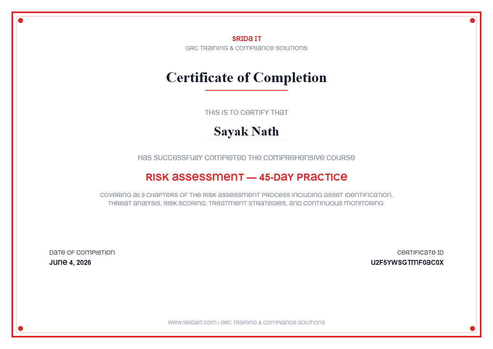

# 🛡️ Risk Assessment — 45-Day Practice | Certified

> **Issued by:** SRIDa IT — GRC Training & Compliance Solutions
> **Completed by:** Sayak Nath
> **Date:** June 4, 2026
> **Certificate ID:** U2F5YWSGTMF0AC0X

---

## What's This About?

I recently completed a **45-day hands-on Risk Assessment course** from SRIDa IT, covering all 10 core chapters of the risk assessment process — from identifying what you need to protect, all the way to documenting and monitoring risks over time.

This wasn't just theory. The course walked through real-world GRC (Governance, Risk & Compliance) thinking — the kind of structured approach that actually gets used in security teams and audits.

---

## 📚 What I Learned — The 10 Chapters

### 1. 🗂️ Identify Assets and Data
Before you can protect anything, you need to know *what* you have. This chapter covered how to map out all the assets in a system — hardware, software, data, people — and understand their value to the organization.

### 2. ☠️ Identify Threats
What could go wrong? This chapter was about thinking like an attacker (and like Murphy's Law). We explored different threat categories — from cyberattacks and insider threats to natural disasters and human error.

### 3. 🔓 Identify Vulnerabilities
Threats alone don't cause damage — they need a weakness to exploit. This chapter focused on spotting those gaps: unpatched systems, weak access controls, poor configurations, and more.

### 4. 📊 Determine Likelihood
Not every risk is equally likely. Here, I learned how to estimate the probability that a threat will actually exploit a vulnerability — using both qualitative scales and quantitative methods.

### 5. 💥 Determine Impact
If something *does* go wrong, how bad is it? This chapter was about measuring the potential damage — financial loss, reputational harm, operational downtime, data exposure — so you can prioritize smartly.

### 6. 🔢 Determine Risk Score
Likelihood × Impact = Risk Score. This chapter tied the previous two together and showed how to calculate risk scores consistently, so you can compare risks across different systems and teams.

### 7. ⚖️ Compare Score with Risk Appetite
Not all risks need to be fixed. Every organization has a "risk appetite" — the level of risk they're comfortable accepting. This chapter taught me how to benchmark your scores against that threshold.

### 8. 🛠️ Risk Treatment
This is where decisions get made. For risks above appetite, you pick a treatment strategy:
- **Mitigate** — reduce the risk
- **Transfer** — shift it (e.g., via insurance or contracts)
- **Accept** — consciously live with it
- **Avoid** — eliminate the risky activity altogether

### 9. 📝 Document
Risk assessments are only useful if they're recorded properly. This chapter covered how to write up findings in a clear, auditable format — risk registers, reports, and evidence trails.

### 10. 🔄 Monitor
Risk is not a one-time task. The final chapter focused on continuous monitoring — how to track changes in the environment, reassess risks periodically, and keep your risk posture up to date.

---

## 🎯 Key Takeaway

Risk Assessment is a **thinking framework**, not just a checklist. The goal is to make informed, defensible decisions about where to spend your security effort and resources — based on what actually matters to your organization.

---

## 🏅 Certificate

*Certificate ID: U2F5YWSGTMF0AC0X | Issued: June 4, 2026 | SRIDa IT — GRC Training & Compliance Solutions*

---

## 🔗 Connect

If you're working in GRC, compliance, or security risk — happy to connect and share notes!
